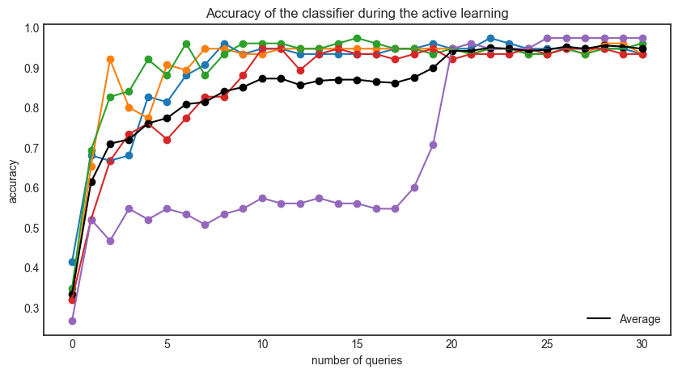

# Active-Learning-Example
Active Learning (AL) allows models to be trained without having to label as much data. This is especially useful when labelling is expensive. By implementing AL, the model is able to query data from an unlabeled pool. Depending on the method of querying, it selects examples that it is most uncertain about. In doing this, the expectation is that it takes less time to both train the model and label data, as the model only learns the examples it is not certain of. 

This coding example uses modAL and the iris dataset to provide an intuitive example. The output shows the average accuracy of multiple AL runs.

For more information on modAL go to: https://modal-python.readthedocs.io/  
For more information on AL read e.g. <em>Settles, B. (2009). Active learning literature survey.</em>

  

  

